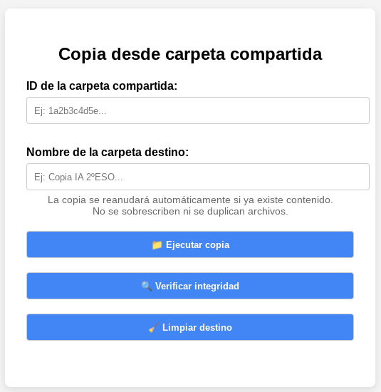

# 🧭 Copiador de carpetas compartidas en Google Drive

Este script de Google Apps Script permite copiar de forma recursiva el contenido de una carpeta compartida de Drive en tu unidad personal, manteniendo un registro de los elementos copiados y permitiendo reanudar la copia en caso de interrupción.

Te pongo en antecedentes:
Tenemos una carpeta en Google Drive que contiene archivos y carpetas y más archivos y más carpetas…. Y quiero hacer una copia en otro drive de otra cuenta que no pertenece a mi dominio. 
Hasta ahora o buscas soluciones de terceros, o haces un zip, lo descargas, lo subes al destino y lo descomprimes allí, una foto finish.

Pero y ¿si compartimos con el correo externo la carpeta que queremos salvaguardar? Esto nos daría acceso directo a la carpeta del drive origen desde el drive destino, … hasta que dejen de compartirla con nuestra cuenta.
Realmente no tenemos la carpeta en nuestro drive de destino y las alternativas para hacerse una copia son las que hemos comentado antes, si la carpeta no contiene mucha estructura es accesible hacerlo a mano pero ¿y si no es el caso?

Con esta solución podemos crear una carpeta copia de la original compartida en una ubicación de su propio drive y elaborar un informe del proceso de copia, también haremos que si el script se para o se interrumpe, podremos pedirle que continúe por donde se quedó.

## 🔧 Funcionalidades principales

- Copia recursiva de todos los archivos y subcarpetas.
- Detección de elementos ya copiados para evitar duplicados.
- Posibilidad de continuar una copia interrumpida sin repetir el trabajo anterior.
- Verificación de integridad: compara el origen con el destino y detecta eliminaciones o modificaciones.
- Limpieza opcional del destino: elimina archivos o carpetas que ya no están en el origen.
- Registro de cada copia (JSON) almacenado en Drive.
- Interfaz sencilla a través de formulario HTML.

## ▶ Cómo instalarlo

1. Crea un nuevo proyecto en Google Apps Script desde [script.google.com](https://script.google.com/) y copia los archivos `Code.gs` y `FormularioDestino.html`.
2. Despliega el proyecto como aplicación web (con permisos de edición).
3. Introduce el ID de la carpeta compartida y un nombre para la carpeta destino.
4. Usa los botones para lanzar la copia, verificar cambios o limpiar el destino.

Para más detalle del proceso, mírate el "manual de uso.pdf" tienes un paso a paso de los códigos, la instalación y ejemplos de uso

> ⚠️ Requiere autorización para acceder a tu Google Drive.

## ✅ Instrucciones de uso

1. Abre el enlace de la app publicada.
2. Introduce el **ID de la carpeta origen** (también puede ser una carpeta compartida).
3. Indica el **nombre que tendrá la copia** en tu Drive.
4. Pulsa **Ejecutar copia** para lanzar una primera copia.
5. Usa los botones **Verificar integridad** o **Limpiar destino** según necesites.

## 📂 Estructura del proyecto

- `Code.gs`: lógica principal del script.
- `FormularioDestino.html`: interfaz de usuario.
- `README.md`: este archivo.
- `ejemplo registro.html`: Un ejemplo del registro generado tras la ejecución de la copia
- `interfaz.png`: Una captura de pantalla de la interfaz HTML
- `manual de uso.pdf`: Una descripción más detallada del código, proceso de despliegue y ejemplos de uso

## 📝 Licencia

Este proyecto se distribuye bajo la licencia MIT.
Puedes modificarlo, adaptarlo y reutilizarlo libremente, citando al autor original si lo deseas.

## ✍️ Autor

Antonio Varela · [https://antoniovarela.es](https://antoniovarela.es/)